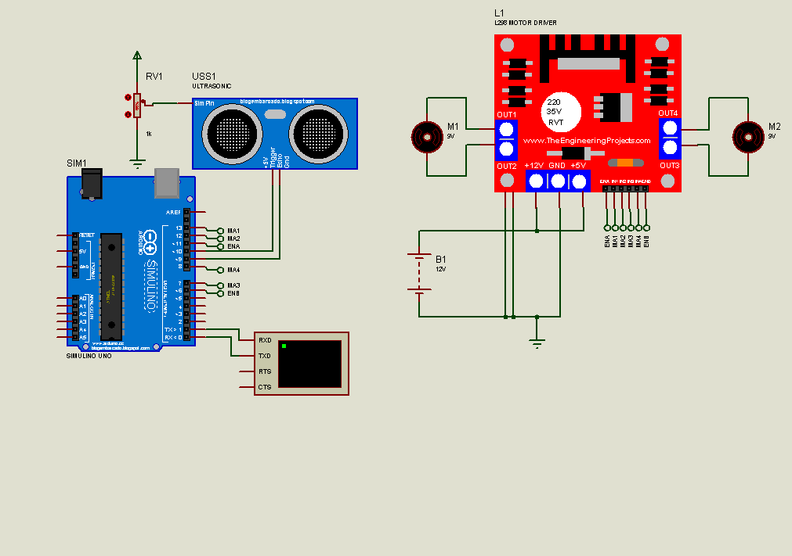

# Robot Autónomo con Arduino

Este proyecto implementa un robot autónomo con Arduino que utiliza un sensor ultrasónico para detectar obstáculos y tomar decisiones de movimiento. El robot puede moverse hacia adelante, atrás, izquierda y derecha, ajustando su trayectoria cuando encuentra obstáculos.

## Características

- Detección de obstáculos mediante sensor ultrasónico HC-SR04
- Control de dos motores DC para movimiento
- Toma de decisiones aleatorias al encontrar obstáculos
- Comunicación serial para depuración
- Simulación completa en Proteus

## Componentes Necesarios

- 1x Arduino UNO
- 2x Motores DC
- 1x Sensor Ultrasónico HC-SR04
- 1x Driver L298N (control de motores)
- Cables de conexión
- Fuente de alimentación para motores

## Conexiones

### Motores y Driver L298N
- Motor A:
  - MA1 -> Pin 13
  - MA2 -> Pin 12
  - ENA -> Pin 11 (PWM)
- Motor B:
  - MA3 -> Pin 8
  - MA4 -> Pin 7
  - ENB -> Pin 6 (PWM)

### Sensor Ultrasónico
- Trigger -> Pin 10
- Echo -> Pin 9

## Código

El código implementa las siguientes funcionalidades principales:

```cpp
// Definición de pines
int MA1 = 13;    // Motor A pin 1
int MA2 = 12;    // Motor A pin 2
int MA3 = 8;     // Motor B pin 1
int MA4 = 7;     // Motor B pin 2
int ENA = 11;    // Enable Motor A
int ENB = 6;     // Enable Motor B
int triggerPin = 10;  // Sensor ultrasónico trigger
int echoPin = 9;      // Sensor ultrasónico echo
```

### Funciones de Movimiento

El robot cuenta con cinco funciones principales de movimiento:

1. `adelante()`: Mueve el robot hacia adelante
2. `atras()`: Mueve el robot hacia atrás
3. `izquierda()`: Gira el robot hacia la izquierda
4. `derecha()`: Gira el robot hacia la derecha
5. `reposo()`: Detiene todos los motores

### Lógica de Control

El programa principal:
1. Mide constantemente la distancia usando el sensor ultrasónico
2. Si la distancia es menor a 50cm:
   - Detiene el robot
   - Elige aleatoriamente entre tres acciones:
     - Retroceder
     - Girar a la derecha
     - Girar a la izquierda
3. Si no hay obstáculos, continúa avanzando

## Simulación en Proteus



El circuito en Proteus incluye:
- Arduino UNO
- Driver L298N
- Dos motores DC
- Sensor HC-SR04
- Conexiones necesarias para la simulación

## Funcionamiento

1. El robot avanza continuamente hacia adelante
2. Cada 500ms realiza una lectura del sensor ultrasónico
3. Si detecta un obstáculo a menos de 50cm:
   - Se detiene
   - Espera 500ms
   - Realiza una maniobra aleatoria
   - Continúa su movimiento

## Instalación y Uso

1. Cargar el código en el Arduino UNO
2. Realizar las conexiones según el diagrama
3. Alimentar el circuito
4. El robot comenzará a moverse automáticamente

## Contribuir

Las contribuciones son bienvenidas. Por favor, abre un issue primero para discutir los cambios que te gustaría realizar.

## Licencia
Este proyecto está bajo la Licencia MIT - ver el archivo [LICENSE](LICENSE) para más detalles.

## Autor
[Pedro Carranza](https://github.com/draexx)
